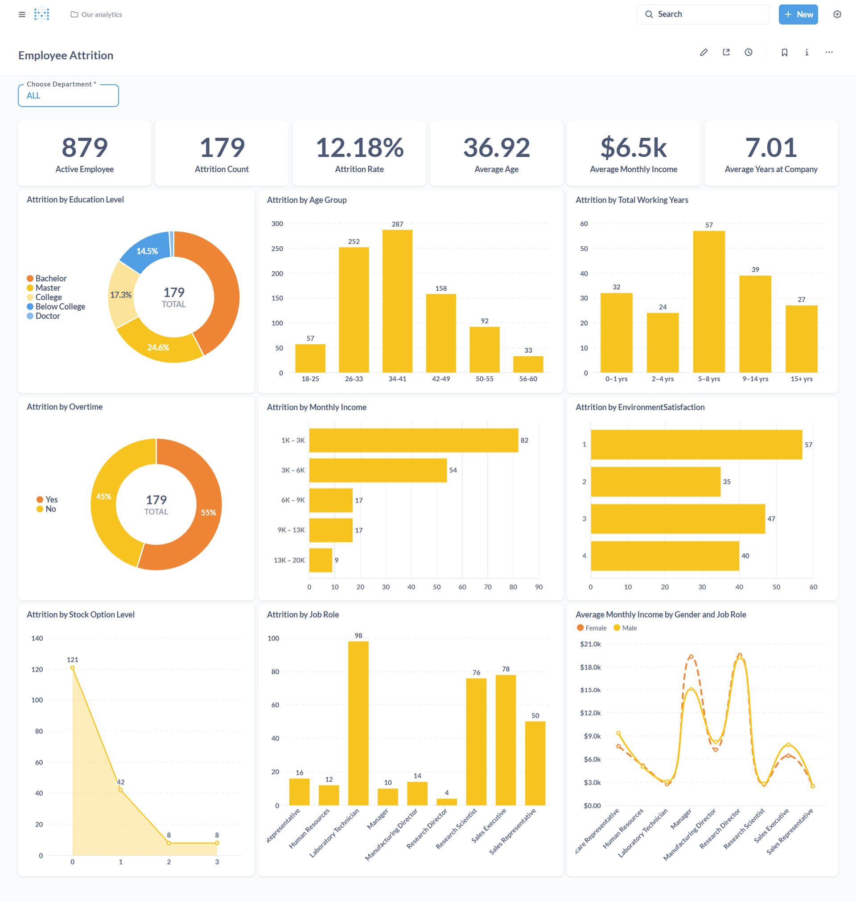

# Proyek Pertama: Menyelesaikan Permasalahan Perusahaan Jaya Jaya Maju

## Business Understanding

**Jaya Jaya Maju** merupakan perusahaan multinasional yang telah berdiri sejak tahun 2000 dan kini memiliki lebih dari 1000 karyawan yang tersebar di seluruh penjuru negeri. Sebagai perusahaan berskala besar, Jaya Jaya Maju telah menunjukkan pertumbuhan yang signifikan dalam dua dekade terakhir dan memainkan peranan penting dalam sektor industrinya.

Namun demikian, meskipun perusahaan telah mencapai skala operasional yang luas, Jaya Jaya Maju menghadapi tantangan serius dalam pengelolaan sumber daya manusia, khususnya terkait tingkat *attrition rate* atau tingkat keluarnya karyawan dari perusahaan. Saat ini, perusahaan mencatat *attrition rate* yang cukup tinggi, yakni melebihi angka 10%. Tingginya tingkat perputaran karyawan ini dapat berdampak buruk terhadap stabilitas operasional, efisiensi tim, serta biaya yang harus dikeluarkan untuk rekrutmen dan pelatihan karyawan baru.

Untuk mengatasi masalah ini, departemen Human Resource (HR) memerlukan pemahaman yang lebih mendalam mengenai faktor-faktor yang mempengaruhi keputusan karyawan untuk keluar dari perusahaan. Dengan wawasan yang tepat, manajemen dapat menyusun strategi intervensi yang efektif untuk meningkatkan retensi karyawan dan menciptakan lingkungan kerja yang lebih baik.

Sebagai bagian dari upaya ini, HR meminta dukungan analisis data untuk mengidentifikasi faktor-faktor utama penyebab *attrition*. Selain itu, HR juga membutuhkan *business dashboard* yang interaktif dan informatif untuk memantau faktor-faktor yang mempengaruhi *attrition rate* secara real-time, serta membantu pengambilan keputusan berbasis data (*data-driven decision making*).

---

### Permasalahan Bisnis

Dalam upaya menjaga stabilitas dan pertumbuhan perusahaan, **Jaya Jaya Maju** menghadapi beberapa permasalahan bisnis yang berkaitan dengan pengelolaan sumber daya manusia, terutama terkait dengan tingginya *attrition rate*. Permasalahan-permasalahan utama yang akan diselesaikan antara lain:

1. **Tingginya Tingkat Attrition (Karyawan Keluar)**  
   Tingkat attrition perusahaan saat ini melebihi 10%, yang tergolong tinggi untuk perusahaan berskala besar. Hal ini berisiko mengganggu kelangsungan operasional perusahaan dan meningkatkan biaya rekrutmen serta pelatihan.

2. **Kurangnya Pemahaman terhadap Faktor Penyebab Attrition**  
   Perusahaan belum memiliki pemahaman yang jelas mengenai faktor-faktor yang mendorong karyawan untuk keluar. Tanpa pemahaman yang mendalam, sulit untuk mengambil langkah preventif yang tepat.

3. **Tidak Tersedianya Sistem Pemantauan yang Efektif**  
   Saat ini, manajemen belum memiliki tools atau dashboard yang dapat memantau secara langsung dan terstruktur berbagai indikator yang berkontribusi terhadap tingkat attrition.

4. **Kesulitan dalam Pengambilan Keputusan Strategis Berbasis Data**  
   Kurangnya visualisasi dan analisis data membuat proses pengambilan keputusan oleh manajer HR menjadi kurang optimal dan bersifat reaktif, bukan proaktif.

5. **Potensi Turunnya Produktivitas dan Moral Karyawan**  
   Tingginya angka keluar masuk karyawan dapat memengaruhi semangat kerja tim yang tersisa dan menurunkan produktivitas secara keseluruhan.

### Cakupan Proyek

Proyek ini akan difokuskan pada analisis data karyawan untuk memahami dan mengidentifikasi faktor-faktor yang memengaruhi tingginya *attrition rate* di perusahaan Jaya Jaya Maju. Adapun cakupan pekerjaan yang akan dilakukan dalam proyek ini meliputi:

1. **Pengumpulan dan Pemahaman Data**  
   Mengakses dan memahami dataset karyawan.

2. **Pembersihan dan Persiapan Data**  
   Melakukan pembersihan data dari duplikasi, nilai kosong, atau ketidakkonsistenan yang dapat memengaruhi hasil analisis. Tahap ini juga mencakup transformasi data jika diperlukan.

3. **Eksplorasi Data dan Analisis Statistik Deskriptif**  
   Menganalisis distribusi data dan melakukan eksplorasi awal untuk memahami pola umum serta perbedaan karakteristik antara karyawan yang keluar dan yang bertahan.

4. **Identifikasi Faktor Penyebab Attrition**  
   Melakukan analisis mendalam (misalnya menggunakan korelasi, visualisasi, dan/atau pemodelan statistik) untuk mengidentifikasi faktor-faktor yang paling berkontribusi terhadap attrition.

5. **Memberikan Rekomendasi Action Items**  
   Memberikan beberapa rekomendasi action items yang dapat diikuti oleh perusahaan untuk mencapai target mereka dalam menurunkan *attrition rate* dan meningkatkan retensi karyawan.

6. **Pembuatan Business Dashboard**  
   Membangun dashboard interaktif yang dapat menampilkan metrik-metrik utama terkait attrition, termasuk tren keluar masuk karyawan, distribusi faktor-faktor penyebab, dan segmentasi karyawan berdasarkan risiko keluar.

7. **Visualisasi Data yang Baik dan Efektif**  
   Membuat visualisasi data yang jelas, efektif, dan mudah dipahami dengan menerapkan prinsip desain yang baik serta menjaga integritas data.

8. **Pembangunan Model Machine Learning**  
   Membuat model machine learning sederhana untuk membantu departemen HR dalam memprediksi kemungkinan seorang karyawan akan keluar. Proyek ini juga akan menyertakan script Python dasar untuk menjalankan proses prediksi tersebut.

9. **Penyusunan Rekomendasi Strategis**  
   Berdasarkan hasil analisis dan prediksi, memberikan rekomendasi kepada tim HR mengenai langkah-langkah yang dapat diambil untuk menekan tingkat attrition dan meningkatkan retensi karyawan.

10. **Penyampaian Hasil Analisis**  
   Menyusun laporan akhir dan mempresentasikan hasil analisis serta dashboard kepada stakeholder terkait dalam format yang mudah dipahami dan actionable.

### Persiapan

#### Sumber Data
Dataset yang digunakan dalam proyek ini dapat diakses melalui tautan berikut:  
🔗 [employee_data.csv - GitHub Dicoding](https://github.com/dicodingacademy/dicoding_dataset/tree/main/employee/employee_data.csv)

Dataset ini berisi informasi demografis, metrik pekerjaan, serta status attrition karyawan.

#### Variabel dalam Dataset

| Variabel | Deskripsi |
|----------|-----------|
| **EmployeeId** | Employee Identifier (ID unik karyawan) |
| **Attrition** | Status apakah karyawan keluar (1 = Ya, 0 = Tidak) |
| **Age** | Usia karyawan |
| **BusinessTravel** | Frekuensi perjalanan dinas |
| **DailyRate** | Gaji harian |
| **Department** | Departemen tempat karyawan bekerja |
| **DistanceFromHome** | Jarak dari rumah ke kantor (dalam km) |
| **Education** | Tingkat pendidikan (1 = Below College, 2 = College, 3 = Bachelor, 4 = Master, 5 = Doctor) |
| **EducationField** | Bidang pendidikan |
| **EnvironmentSatisfaction** | Kepuasan terhadap lingkungan kerja (1 = Rendah, 2 = Sedang, 3 = Tinggi, 4 = Sangat Tinggi) |
| **Gender** | Jenis kelamin |
| **HourlyRate** | Gaji per jam |
| **JobInvolvement** | Keterlibatan dalam pekerjaan (1 = Rendah, 2 = Sedang, 3 = Tinggi, 4 = Sangat Tinggi) |
| **JobLevel** | Level pekerjaan (1–5) |
| **JobRole** | Jabatan atau peran pekerjaan |
| **JobSatisfaction** | Kepuasan kerja (1 = Rendah, 2 = Sedang, 3 = Tinggi, 4 = Sangat Tinggi) |
| **MaritalStatus** | Status pernikahan |
| **MonthlyIncome** | Gaji bulanan |
| **MonthlyRate** | Gaji per bulan (rate) |
| **NumCompaniesWorked** | Jumlah perusahaan yang pernah ditempati |
| **Over18** | Apakah berusia di atas 18 tahun? |
| **OverTime** | Apakah bekerja lembur? |
| **PercentSalaryHike** | Persentase kenaikan gaji terakhir |
| **PerformanceRating** | Penilaian kinerja (1 = Rendah, 2 = Baik, 3 = Sangat Baik, 4 = Luar Biasa) |
| **RelationshipSatisfaction** | Kepuasan terhadap relasi kerja (1–4) |
| **StandardHours** | Jam kerja standar |
| **StockOptionLevel** | Level opsi saham |
| **TotalWorkingYears** | Total tahun pengalaman kerja |
| **TrainingTimesLastYear** | Jumlah pelatihan yang diikuti tahun lalu |
| **WorkLifeBalance** | Keseimbangan kerja dan kehidupan (1–4) |
| **YearsAtCompany** | Lama bekerja di perusahaan saat ini |
| **YearsInCurrentRole** | Lama di posisi saat ini |
| **YearsSinceLastPromotion** | Lama sejak terakhir dipromosikan |
| **YearsWithCurrManager** | Lama bekerja dengan manajer saat ini |

#### Sumber Referensi
📚 [IBM Watson Analytics - HR Use Case](https://www.ibm.com/communities/analytics/watson-analytics-blog/watson-analytics-use-case-for-hr-retaining-valuable-employees/)


### Setup environment:
Dokumentasi ini menjelaskan langkah-langkah setup environment untuk menjalankan project analisis dan prediksi *Employee Attrition*.

#### 1. Buat dan Aktifkan Virtual Environment (Opsional tapi Direkomendasikan)

```bash
# Buat virtual environment
python -m venv venv

# Aktifkan (Windows)
venv\Scripts\activate

# Aktifkan (Mac/Linux)
source venv/bin/activate
```

####  2. Install Semua Dependensi

Install semua library yang dibutuhkan dengan:
```bash
pip install -r requirements.txt
```

---

## Business Dashboard



Dashboard ini dirancang untuk menganalisis dan memvisualisasikan berbagai faktor yang mempengaruhi **attrition** (keluarnya karyawan) dalam organisasi. Tujuannya adalah untuk membantu manajemen mengambil keputusan strategis berbasis data.

## Ringkasan Informasi Utama

- **Total Active Employees:** 879  
- **Attrition Count:** 179  
- **Attrition Rate:** 12.18%  
- **Average Age:** 36.92 tahun  
- **Average Monthly Income:** $6.5K  
- **Average Years at Company:** 7.01 tahun  

## Visualisasi dan Insight Penting

### 1. Attrition by Education Level
- Mayoritas attrition berasal dari karyawan dengan gelar **Bachelor (42.46%)** dan **Master (24.6%)**.
- Pendidikan menengah menunjukkan kerentanan lebih tinggi terhadap attrition.

### 2. Attrition by Age Group
- Usia **34–41 tahun** dan **26–33 tahun** merupakan kelompok usia dengan attrition tertinggi.
- Usia ini biasanya merupakan masa puncak pertumbuhan karier.

### 3. Attrition by Total Working Years
- Karyawan dengan **5–8 tahun pengalaman kerja** mengalami attrition tertinggi.
- Fase ini mungkin mencerminkan ekspektasi kenaikan jabatan atau perubahan karier.

### 4. Attrition by Overtime
- **55%** karyawan yang keluar mengalami **lembur (overtime)**.
- Overtime terbukti menjadi pemicu kelelahan dan niat untuk keluar.

### 5. Attrition by Monthly Income
- Gaji rendah (1K–3K dan 3K–6K) berkontribusi pada attrition tertinggi.
- Kompensasi yang tidak kompetitif menjadi alasan utama turnover.

### 6. Attrition by Environment Satisfaction
- Level kepuasan lingkungan kerja **terendah (Level 1)** memiliki attrition tertinggi.
- Perlu perbaikan lingkungan kerja dan budaya organisasi.

### 7. Attrition by Stock Option Level
- **Stock Option Level 0** mendominasi attrition (121 dari 179).
- Insentif finansial seperti opsi saham efektif dalam mempertahankan karyawan.

### 8. Attrition by Job Role
- Role dengan attrition tertinggi:  
  - **Laboratory Technician (98)**  
  - **Sales Representative (78)**  
  - **Sales Executive (50)**
- Job role tertentu rentan karena tekanan kerja atau kurangnya prospek.

### 9. Average Monthly Income by Gender and Job Role
- Tidak ada gap signifikan antara gender.
- Namun perbedaan income antar job role cukup mencolok.

---

## Conclusion

Berdasarkan hasil analisis data dan visualisasi dalam dashboard, dapat disimpulkan bahwa perusahaan **Jaya Jaya Maju** sedang menghadapi tantangan serius terkait tingginya tingkat *attrition* karyawan. Dengan *attrition rate* sebesar **12.18%**, kondisi ini menunjukkan adanya risiko signifikan terhadap stabilitas operasional dan efisiensi SDM.

Dashboard yang dibangun berhasil mengidentifikasi pola-pola utama terkait attrition, termasuk distribusi berdasarkan usia, pendidikan, pendapatan, overtime, dan job role. Beberapa kelompok karyawan menunjukkan kecenderungan keluar yang lebih tinggi dibandingkan yang lain, seperti mereka yang memiliki penghasilan rendah, bekerja lembur, serta berada pada level stock option terendah.

Lebih lanjut, visualisasi data memberikan pemahaman yang lebih baik mengenai faktor-faktor demografis dan lingkungan kerja yang berkontribusi terhadap keputusan karyawan untuk keluar. Hal ini menjawab salah satu permasalahan bisnis utama, yaitu kurangnya pemahaman terhadap akar penyebab *attrition*.

Secara keseluruhan, proyek ini berhasil menyediakan fondasi analitik yang solid untuk membantu perusahaan memahami tantangan SDM secara lebih komprehensif, serta memberikan landasan yang kuat untuk pengambilan keputusan berbasis data ke depannya.


### Rekomendasi Action Items

- **Evaluasi dan Revisi Kebijakan Lembur:**  
  Kurangi beban kerja lembur, terutama pada departemen dengan tingkat attrition tinggi, serta dorong budaya *work-life balance*.

- **Tingkatkan Kompensasi dan Tunjangan:**  
  Lakukan benchmarking gaji terhadap industri sejenis dan pertimbangkan peningkatan kompensasi bagi karyawan dengan penghasilan di bawah rata-rata.

- **Program Retensi Berdasarkan Job Role:**  
  Fokuskan inisiatif retensi seperti pelatihan, mentoring, dan jalur karier pada *job role* dengan turnover tinggi seperti *Laboratory Technician* dan *Sales Representative*.

- **Tingkatkan Kepuasan Lingkungan Kerja:**  
  Lakukan survei kepuasan secara berkala dan tindak lanjuti hasilnya untuk menciptakan lingkungan kerja yang lebih sehat dan suportif.

- **Perluas Insentif Finansial:**  
  Tinjau ulang distribusi *stock option* agar lebih merata dan dapat dijadikan alat retensi untuk karyawan berpotensi tinggi.

- **Program Pengembangan Karier:**  
  Sediakan jalur promosi dan pengembangan yang jelas, terutama bagi karyawan dengan pengalaman kerja 5–8 tahun.

- **Kampanye Internal Engagement dan Awareness:**  
  Luncurkan kampanye untuk meningkatkan keterlibatan karyawan dan memperkuat nilai-nilai organisasi.